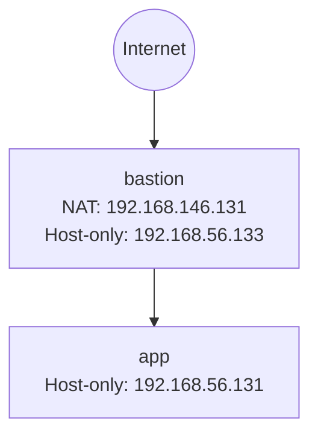
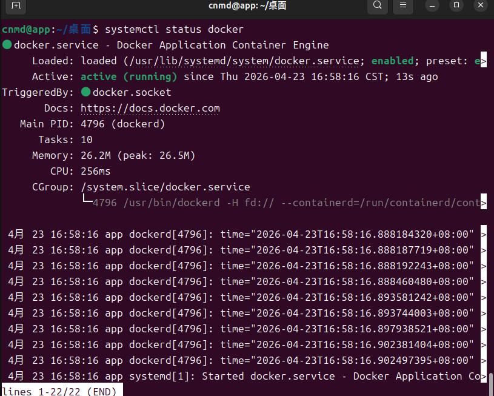
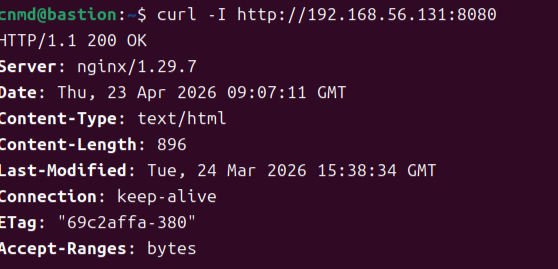
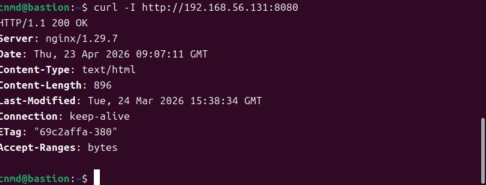
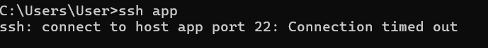
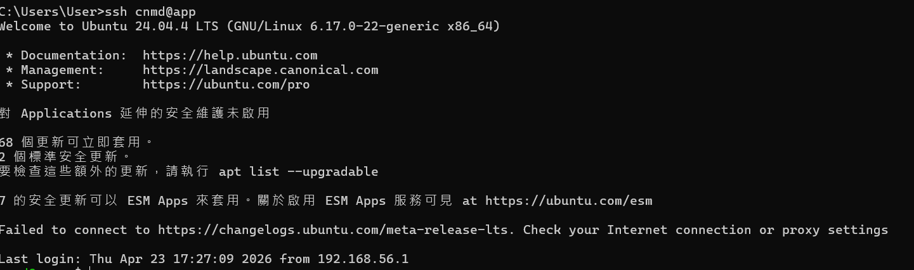
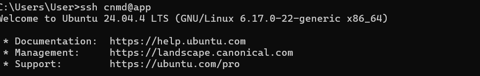
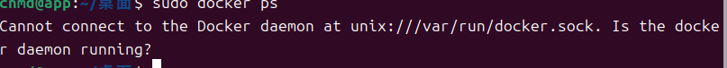
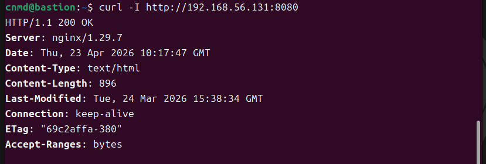

# 期中實作 — <412631128> <陳冠宏>

## 1. 架構與 IP 表



| VM      | Interface | Type      | IP Address      |
| ------- | --------- | --------- | --------------- |
| bastion | ens33     | NAT       | 192.168.146.131 |
| bastion | ens37     | Host-only | 192.168.56.133  |
| app     | ens33     | Host-only | 192.168.56.131  |

<

## 2. Part A：VM 與網路
**命令：**
```bash
ip -4 addr show
```


##關鍵輸出：
```bash
inet 192.168.146.131/24   # NAT
inet 192.168.56.133/24    # Host-only
```


##app命令：
```bash
ip -4 addr show
```

##關鍵輸出：
```bash
inet 192.168.56.131/24
```


##連線測試bastion → app命令：
```bash
ping -c 2 192.168.56.131
```

##輸出：
```bash
2 packets transmitted, 2 received, 0% packet loss
```


##app → bastion命令：
```bash
ping -c 2 192.168.56.133
```

##輸出：
```bash
2 packets transmitted, 2 received, 0% packet loss
```


## 3. Part B：金鑰、ufw、ProxyJump
### 防火牆規則表

| 主機     | 規則 |
|----------|------|
| bastion  | default deny incoming |
| bastion  | allow 22/tcp |
| app      | default deny incoming |
| app      | allow from 192.168.56.133 to any port 22 proto tcp |


ProxyJump 成功證據


## 4. Part C：Docker 服務
<Docker 運行狀態

nginx 服務測試（HTTP 200）



## 5. Part D：故障演練
### 故障 1：<F1/F2/F3 擇一>
- 注入方式：F2（app 防火牆封鎖 SSH）
sudo ufw delete 1
sudo ufw delete 1
sudo ufw default deny incoming
sudo ufw status
- 故障前：


- 故障中：

- 回復後：

- 診斷推論：在故障中，Host 端出現 ssh connection timed out。此現象代表 TCP 封包沒有收到回應（被丟棄），而非被主機立即拒絕。

在 app 端檢查：
- ss -tlnp 顯示 sshd 仍在監聽 22/tcp，表示 SSH 服務本身正常
- ufw status 顯示未允許 22/tcp，表示封包在防火牆層被阻擋

因此可判定：
連線問題並非來自服務或網路介面，而是防火牆規則造成封包被丟棄（L4 層阻擋）。

### 故障 2：<F3（停止 Docker daemon）>
注入方式：sudo systemctl stop docker
sudo systemctl stop docker.socket
- 故障前：
- 故障中：
- 回復後：


### 症狀辨識（我選F2+F3）
F2 發生時，連 SSH 都無法連線，表示問題在網路或防火牆層（封包被阻擋）。

F3 發生時，SSH 正常但 Docker 無法使用，表示主機與網路正常，
問題僅發生在 Docker 服務（應用層）。

因此可透過「是否能 SSH」快速區分：
不能 SSH → 網路/防火牆問題（F2）
能 SSH 但服務壞 → 應用服務問題（F3）

## 6. 反思（200 字）
這次做完，對「分層隔離」或「timeout 不等於壞了」的理解有什麼改變？
這次實作讓我對「分層隔離」有更具體的理解。以前遇到連線失敗，直覺會認為整個系統壞掉，但透過 F2 與 F3 的比較，我發現不同層級的問題其實會呈現不同症狀。像 F2 防火牆封鎖時，SSH 直接 timeout，表示封包在網路或安全層被丟棄；但 F3 停止 Docker 時，SSH 仍可登入，只是 docker 指令無法使用，代表問題發生在服務層而非主機或網路。這讓我理解到「timeout 不等於壞掉」，而是需要進一步判斷是哪一層出問題。未來排錯時，我會先分層檢查：網路連線、服務監聽、防火牆規則，而不是一開始就亂重裝或重開機。這種分層思考能讓問題定位更快、更準確。
## 7. Bonus（選做）

