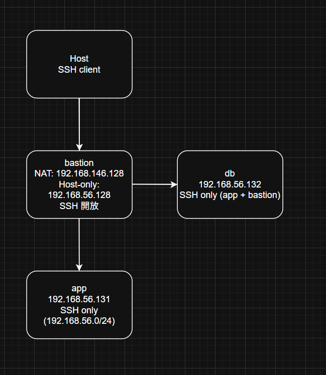

# W03｜多 VM 架構：分層管理與最小暴露設計

## 網路配置

| VM | 角色 | 網卡 | 模式 | IP | 開放埠與來源 |
|---|---|---|---|---|---|
| bastion | 跳板機 | NIC 1 | NAT | 192.168.146.128 | SSH from any |
| bastion | 跳板機 | NIC 2 | Host-only | 192.168.56.128 | — |
| app | 應用層 | NIC 1 | Host-only | 192.168.56.131 | SSH from 192.168.56.0/24 |
| db | 資料層 | NIC 1 | Host-only | 192.168.56.132 | SSH from app + bastion |

## SSH 金鑰認證

- 金鑰類型：ed25519
- 公鑰部署到：app 和 db 的 ~/.ssh/authorized_keys
- 免密碼登入驗證：
  - bastion → app：

  - bastion → db：

## 防火牆規則

### app 的 ufw status

### db 的 ufw status

### 防火牆確實在擋的證據

## ProxyJump 跳板連線
- 指令：ssh -J cnmd@192.168.56.128 cnmd@192.168.56.131 "hostname"
- 驗證輸出：

- SCP 傳檔驗證：

## 故障場景一：防火牆全封鎖

| 項目 | 故障前 | 故障中 | 回復後 |
|---|---|---|---|
| app ufw status | active + rules | deny all | active + rules |
| bastion ping app | 成功 |  成功 | 成功 |
| bastion SSH app | 成功 | **timed out** |  成功 |

## 故障場景二：SSH 服務停止

| 項目 | 故障前 | 故障中 | 回復後 |
|---|---|---|---|
| ss -tlnp grep :22 | 有監聽 | 無監聽 |  有監聽 |
| bastion ping app | 成功 | 成功 | 成功 |
| bastion SSH app | 成功 | **refused** | 成功 |

## timeout vs refused 差異
timeout 是連過去完全沒回應，通常是被防火牆擋掉，要去看 ufw 設定。
refused 是有連到主機，但那個 port 沒開（服務沒跑），要去看 ssh 或服務有沒有開。

簡單講：
timeout＝被擋住
refused＝有門但沒人

## 網路拓樸圖

## 排錯紀錄
- 症狀：一開始 ping app 出現 Destination Host Unreachable，無法連線
- 診斷：先用 ip address 檢查各 VM 的 IP，發現雖然同網段，但實際沒有連通，判斷是網卡設定問題
- 修正：重新調整 VMware 網路，將三台 VM 的 Host-only 都設成同一個網段（VMnet1），並重新啟動 VM
- 驗證：重新用 ping 測試成功，再用 ssh 可以正常連線，確認問題已解決

## 設計決策
本次設計採用「跳板機（bastion）」作為唯一對外入口，app 和 db 都不直接對外開放，這樣可以降低被攻擊的風險。

db 允許 bastion 直接連線，而不是只允許 app，主要是考慮到管理方便。如果 app 出問題時，仍然可以從 bastion 直接進入 db 進行維護與排錯，不會完全失去控制。

整體是在「安全性」和「維護便利性」之間做平衡，避免系統太封閉導致無法操作。
